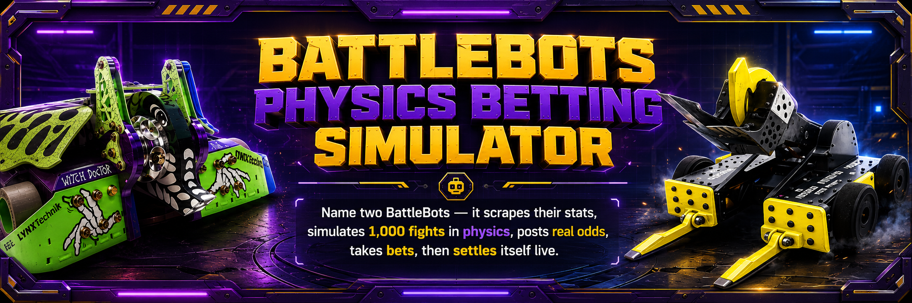

# RINGSIDE ARENA

Name any two BattleBots. It scrapes them into existence, fights the fight 1,000 times in
physics before it happens, posts computed odds, takes the room's bets, then the real fight
airs and the machine settles itself in front of everyone.

Built live at BattleBots Hack Night London (Bright Data), 28 July 2026.

## What actually happens

1. **Someone shouts two fighter names.** Nothing is pre-loaded; any Pro League bot works.
2. **The scrape becomes a body.** Live Bright Data calls hit Wikipedia and the BattleBots
   fandom wiki (visible in the on-screen trace panel, every call receipted). The fused specs
   assemble a parametric 3D robot on screen: the weapon archetype picks the rig, the weight
   class scales the chassis. Data literally becomes embodiment.
3. **Physics fights the fight before reality does.** A deterministic Rapier simulation seeded
   from the scraped stats runs 1,000 headless bouts. One marquee bout renders in full 3D with
   slow-mo hits. The posted line is computed by a weapon-archetype Elo engine over real fight
   records. No LLM guesses any number, anywhere.
4. **The room bets.** QR code, no login, play points. Lines close on a lock ritual; late bets
   void. The prediction is sha256-hashed and git-committed BEFORE the fight, so the record
   cannot be quietly edited.
5. **Reality grades the machine.** The moment the real fight ends, the result is scraped and
   the system settles itself: payouts, a public append-only Elo scar ledger, and a running
   accuracy ticker. When the data is too thin it refuses to post a line at all: insufficient
   evidence, bets void. An honest bookie.

## Honesty mechanics (the point of the build)

- **Computed, not guessed:** strip the LLM and the odds, the sim, and the settlement all
  still work. The one LLM call is a nullable commentator sentence on top.
- **Pre-commit:** every prediction hash is git-committed before settlement can run.
- **Abstention:** below the sample threshold the bookie posts no line instead of a fake one.
- **Labeled settlement:** every settled fight shows whether the result came from a live
  scrape or an operator confirmation. The UI never claims autonomy it did not have.

## Stack

```
src/lib/data/    live scrape + fuse (Bright Data Web Unlocker path + MediaWiki APIs)
src/core/        weapon-archetype Elo engine + Rapier headless Monte Carlo + marquee recorder
src/three/       parametric 3D bot assembly + marquee fight renderer (react-three-fiber)
src/app/         big-screen console, QR bet page, lock/settle state machine (Next.js 16)
data/            SQLite (fight records, matchups, bets, settlements, Elo ledger)
```

## Run

```bash
bun install
cp .env.example .env.local   # BRIGHTDATA_API_TOKEN, GROQ_API_KEY
bun scripts/ingest.ts Tombstone Hydra Ripperoni   # seed real fight records
bun run dev
```

Big screen: `/`. Phones: `/bet/<matchup-id>` via the on-screen QR.

## Team

Rassa, Luka and Andrea, with a fleet of Claude agents as the build crew.
